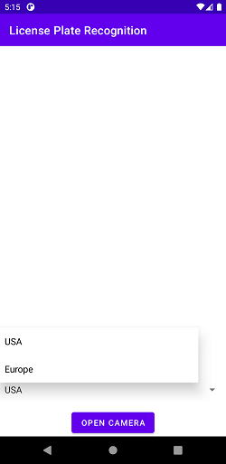
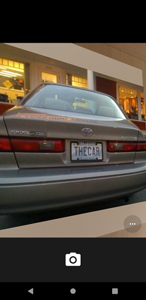
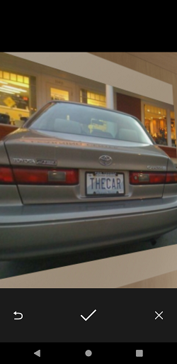
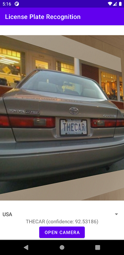

License plate recognition client
================================

*Android*-приложение для распознавания регистрационных номеров транспортных средств. Позволяет
фотографировать автомобиль и полученный снимок отправляет на
[сервер](https://github.com/m19ivt1/license-plate-recognition-server), где происходит распознавание
номера.

Технические требования смартфона
--------------------------------
* Операционная система *Android*, версии `4.1` (`minSdkVersion=16`) и выше
* Наличие камеры
* Активное соединение с интернетом

Скриншоты
---------

  
   
  
  

